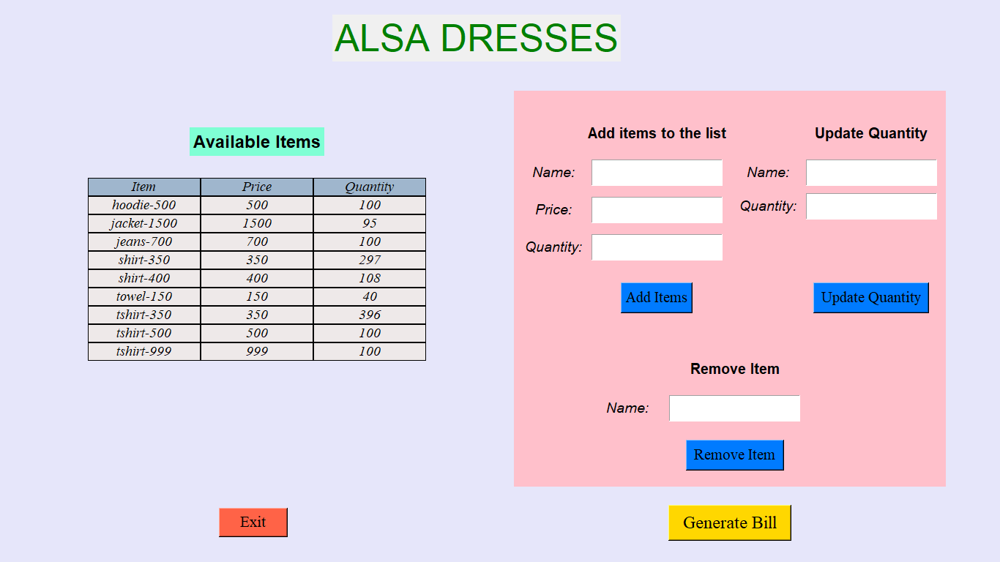

# Bill Management System

## Overview
The Bill Management System is a Python application built using the Tkinter library for creating a user-friendly interface. This system allows users to manage product details, generate bills, and display invoices in a seamless manner. 

## Features
- **Window 1: Main User Interface**
  - Displays shop name and product details table.
  - Supports operations like adding, updating, and removing items.
  - Provides buttons for exiting the program and generating bills.

- **Window 2: Customer Details Form**
  - Collects customer information and selected items.
  - Allows users to add items to the bill.
  - Provides options to cancel or generate the bill.

- **Window 3: Bill Invoice Display**
  - Shows the generated bill invoice to the user.

## Technologies Used
- Python
- Tkinter

## Installation
1. Clone the repository: `git clone https://github.com/yourusername/bill-management-system.git`
2. Navigate to the project directory: `cd bill-management-system`
3. Run the application: `python main.py`

## Usage
1. Launch the application.
2. Use Window 1 to manage product details and operations.
3. Use Window 2 to input customer details and select items for the bill.
4. Generate the bill and view the invoice in Window 3.

## Screenshots

## Contributors
- [Your Name](https://github.com/yourusername)

## License
This project is licensed under the [MIT License](LICENSE).

## Acknowledgements
- Thanks to [Tkinter](https://docs.python.org/3/library/tkinter.html) for providing the GUI framework.
- Special thanks to [OpenAI](https://openai.com) for their assistance and support.
